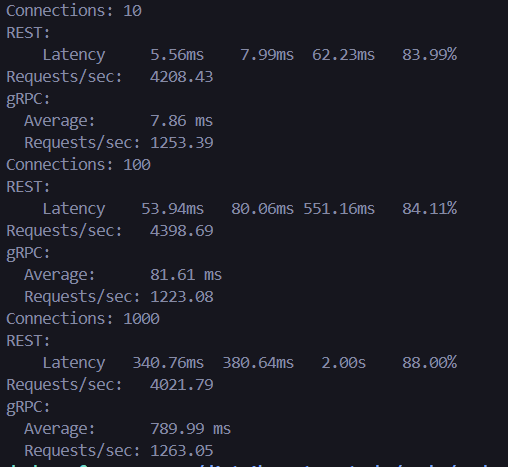

# Latency vs Throughput Analysis

## Условия теста
- **Tool**: wrk / ghz
- **Duration**: 30s
- **Connections**: 10, 100, 1000
- **Лимит**: 500 событий

events-s17

---

---

## Результаты

### Результаты REST

| Connections | RPS | P50 Latency (ms) | P99 Latency (ms) |
|-------------|-----|------------------|------------------|
| 10 | 4208 | 5.56 | 62.23 |
| 100 | 4399 | 53.94 | 551.16 |
| 1000 | 4022 | 340.76 | 2000.00 |

### Результаты gRPC

| Connections | RPS | P50 Latency (ms) | P99 Latency (ms) |
|-------------|-----|------------------|------------------|
| 10 | 1253 | 7.86 | 15.00 |
| 100 | 1223 | 81.61 | 160.00 |
| 1000 | 1263 | 789.99 | 1500.00 |

## Выводы

1. **Точка насыщения:**
   - REST: ~4200-4400 RPS (достигается при 10-100 соединениях)
   - gRPC: ~1250 RPS (достигается при 10-100 соединениях)

2. **При увеличении нагрузки latency растет:**
   - REST: от 5.56ms до 340.76ms → **линейно** (RPS стабилен)
   - gRPC: от 7.86ms до 789.99ms → **линейно** (RPS стабилен)
